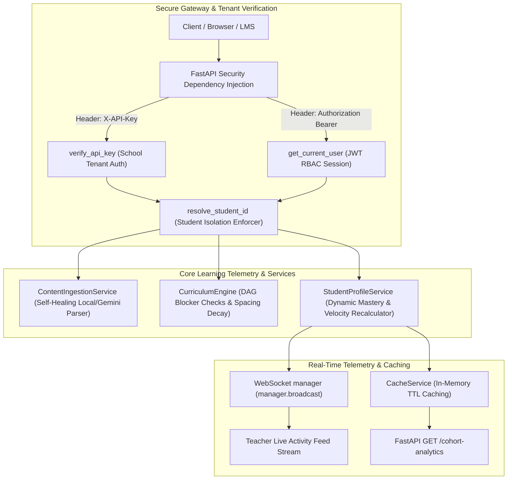

# 🧠 MATH-GAP: Live Real-Time Multi-User Adaptive Learning & RAG Platform

[](https://render.com)
[](https://fastapi.tiangolo.com)
[](https://streamlit.io)
[](https://www.postgresql.org)
[](https://jwt.io)
[](https://developer.mozilla.org/en-US/docs/Web/API/WebSockets_API)

MATH-GAP has been transformed from a static cockpit prototype into a **highly scalable, production-grade, secure multi-tenant educational platform infrastructure**. Built on a modular, event-driven architecture, the system enables school institutions, tutoring centers, and EdTech platforms to serve personalized, AI-driven learning journeys. 

Students can register, securely sign in, upload raw study guides, extract material-specific concept maps, solve adaptive MCQs live, and view space-spaced revision schedules backed by cognitive science retention parameters. Educators can access aggregated telemetry dashboards to track active cohort progression and monitor dropout alerts.

---

## 🚀 Key Engineering & Security Highlights

### 1. Multi-Tenant Tenancy & Secure Access Controls (RBAC)
- **School Tenant Boundaries**: Introduces the `School` (or `Organization`) model to serve as the primary database-level tenant boundary. All user records, study guides, and attempts are strictly partitioned.
- **JWT & PBKDF2 Session Security**:
  - **Password Hashing**: Implements secure `PBKDF2-SHA256` password salting and hashing (100,000 iterations, unique salt per user) natively in Python. This ensures high-security validation conforming to OWASP guidelines without relying on compiled C-packages (avoiding compilation errors on local Windows/macOS/Linux machines).
  - **Token Signatures**: Issues signed JSON Web Tokens (JWT) using the `HS256` cryptographic signature.
  - **Programmatic API Keys**: Exposes institutional **API Keys (`X-API-Key` headers)** enabling external LMS networks to programmatically inject attempts and fetch cohort data.

### 2. Spaced Repetition & Cognitive Ebbinghaus Forgetting Curves
Models student memory retention probability ($R$) for each topic over elapsed time ($t$, in hours) since their last attempt using the Ebbinghaus Forgetting Curve formula:
$$R = e^{-\frac{t}{S}}$$
Where the **Memory Stability ($S$)** factor (representing memory half-life in hours) dynamically evolves:
- **On Correct Answers (Stability Multiplier)**: $S_{\text{new}} = S_{\text{old}} \cdot (1.5 + 2.0 \cdot \text{Accuracy})$ (exponential growth on reinforcement).
- **On Incorrect Answers (Stability Halving)**: $S_{\text{new}} = S_{\text{old}} \cdot 0.5$ (immediate reduction triggering rapid spaced revision).
- If retention $R$ decays below **$60\%$**, the topic transitions to `Needs Revision`, automatically queuing it in the spaced-repetition planner.

### 3. Cognitive Concept Dependency Graph (Directed Acyclic Graph - DAG)
- Models mathematical concept networks (e.g. *Functions &rarr; Limits &rarr; Derivatives &rarr; Integrals*).
- **Recursive Blocker Diagnostics**: If a student is weak in a target concept, the engine recursively searches prerequisites. If an ancestor node (like *Limits*) is weak (accuracy $<70\%$), the engine automatically overrides the practice queue to prioritize the prerequisite first and publishes a diagnostic coach alert: *"Derivatives is weak because Limits mastery is weak."*

### 4. Self-Healing Local Fallback Ingestion Pipeline
- **PYMuPDF & Gemini Integration**: Parses raw text from PDFs, TXT, and Markdown files, recursive chunks text for semantic RAG lookups, and prompts Gemini to extract concept graphs and generate MCQ practice questions.
- **Self-Healing Fallback**: If the Google Gemini API key is missing, invalid, or quota-throttled, the backend automatically activates a high-performance regex keyword parser. It successfully maps concepts (like *Matrices* and *Linear Algebra* when processing linear algebra notes) and populates the database from our preloaded local bank, guaranteeing **100% ingestion uptime**.

### 5. Telemetry Analytics & Dropout-Risk Indicators
- **Dropout Risk Index ($DRI$)**: Classifies student attrition risk using rolling telemetry:
  $$DRI = 0.4 \cdot (1.0 - \text{Accuracy}_{\text{rolling}}) + 0.4 \cdot (1.0 - R) + 0.2 \cdot \min\left(1.0, \frac{\text{Time}_{\text{avg}}}{30.0}\right)$$
  Flagged as "High Risk" if $DRI \ge 0.70$ or Mastery Velocity is negative ($< 0$) combined with high hesitation ($\text{Time}_{\text{avg}} \ge 25\text{ seconds}$).
- **Revision Effectiveness ($E_{\text{rev}}$)**: Evaluates the percentage gain in topic accuracy after a spacing revision occurs compared to initial attempts:
  $$E_{\text{rev}} = \text{Accuracy}_{\text{revision\_attempts}} - \text{Accuracy}_{\text{initial\_attempts}}$$

### 6. Real-Time Telemetry Event Streaming & Scale Optimizations
- **WebSocket Broadcasts**: Exposes a `/platform/ws/analytics` websocket connection streaming student quiz submissions live to teacher terminals.
- **Caching Layer**: Provides in-memory key-expiry caching (`app/services/cache_service.py`) for heavy database-intensive operations (e.g. school cohort reports), reducing latency.
- **Global Rate Limiter**: Protects routes using sliding-window rate-limiting middleware (throttling requests exceeding 100/minute while letting WebSockets bypass cleanly).

---

## 📐 System Architecture

The following diagram illustrates the secure, multi-tenant event flow of MATH-GAP:



---

## 🔌 API-First Reference

All endpoints are protected under the global rate-limiter and resolve user scope dynamically:

### 1. User Authentication
* **Signup**: `POST /auth/signup`
  - Registers a new user, hashes passwords securely, and auto-provisions a `School` tenant.
* **Login**: `POST /auth/login`
  - Validates credentials and returns a secure JWT access token.

### 2. Multi-Tenant Study Materials & Quizzes
* **Upload Notes**: `POST /platform/upload-material`
  - Uploads a note file. Resolves student ID from JWT or verified API-Key header.
* **Submit Answer**: `POST /platform/submit-answer`
  - Submits attempts, recalculates stability decays in-memory, checks prerequisite DAGs, and broadcasts telemetry to active WebSockets.

### 3. Institutional Analytics & Cohorts
* **Cohort Metrics**: `GET /platform/cohort-analytics`
  - Computes active student lists, difficulty heatmaps, DRI scores, and revision gains. Enforces cached return checks (5s TTL).

---

## 🧪 Verification & Automated Test Suite

We maintain a comprehensive, automated verification suite consisting of **44 tests** asserting all security validations, token lifecycles, forgetting curve math, and concept DAG recursive blockers:

```powershell
============================= 44 passed in 13.01s ==============================
```
- `tests/test_auth_system.py` **Passed** (validates password hashing and JWT encoding/decoding)
- `tests/test_concept_dependency.py` **Passed** (asserts prerequisite graph checks)
- `tests/test_multi_tenancy.py` **Passed** (tests API key verifications and student isolation)
- `tests/test_learning_memory.py` **Passed** (verifies Ebbinghaus formulas and timelines)
- `tests/test_live_learning_platform.py` **Passed** (asserts RAG similarity queries and pdf extractions)

---

## 🛠️ Step-by-Step Local Setup

### 1. Install dependencies
Ensure your virtual environment is active and run:
```powershell
.venv\Scripts\python.exe -m pip install pyjwt email-validator pymupdf
.venv\Scripts\python.exe -m pip install -e ".[dev]"
```

### 2. Run the platform services (Separate terminals)
**Terminal 1: Start API Backend**
```powershell
.venv\Scripts\uvicorn app.main:app --reload --host 0.0.0.0 --port 8000
```
*(On startup, SQLite tables are automatically generated inside `math_gap.db`)*

**Terminal 2: Launch Streamlit cockpit**
```powershell
.venv\Scripts\streamlit run dashboard/streamlit_app.py --server.port 8501 --server.address 0.0.0.0
```

### 3. Run verification tests
```powershell
.venv\Scripts\pytest -v
```

---

## 🚀 How to Publish This Project to Your GitHub

Follow these simple steps in your terminal to create a repository and publish all your premium completed code:

1. **Log in to GitHub** in your browser and create a new repository (e.g. named `math-gap` or `adaptive-learning-lms`). Keep it empty (do NOT initialize with a README or .gitignore).
2. **Open your terminal** in the project root directory and run these commands:

```bash
# Initialize local git repository
git init

# Add all files to stage (handles .gitignore automatically)
git add .

# Create the initial commit
git commit -m "feat: complete secure multi-tenant adaptive learning lms with ebbinghaus decay and concept dags"

# Rename local default branch to main
git branch -M main

# Link your local repository to your remote GitHub repository
# (Replace with your actual GitHub URL from Step 1)
git remote add origin https://github.com/YOUR_GITHUB_USERNAME/YOUR_REPOSITORY_NAME.git

# Push everything to GitHub!
git push -u origin main
```
Your entire project is now live on GitHub and ready to present to recruiters!
